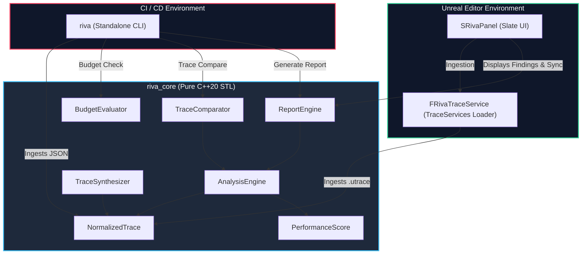

# Riva

**Riva** is a deterministic performance diagnostics companion for Unreal Engine. It analyzes trace recordings from Unreal Insights and JSON trace exports to automatically isolate performance hitches, score bottleneck confidence, resolve root causes, enforce performance budgets, and compare trace runs for regressions.

---

## Features

- **Deterministic Diagnostics Engine**: Rolling median spike detection with zero non-deterministic heuristics.
- **Performance Scoring System**: Deterministic 0-100 grading with A-F letter grades and per-subsystem breakdowns (Game Thread, Render Thread, GPU, Physics, AI, Network).
- **Quantitative Trace Comparison**: Diffs baseline vs. new trace runs and generates Metric Summary tables with P50/P90/P95/P99 deltas and hitch % regressions.
- **Synthetic Telemetry Generation**: Built-in pathology generator to programmatically inject frame spikes (shader compile, PSO miss, GC, etc.) for testing and ground-truth validation.
- **Root Cause & Causal Resolution**: Automatically links concurrent stalls (e.g. streaming IO or GC triggering Game Thread / RHI waits) and elevates root causes over symptomatic stalls.
- **Multi-Spike Correlation**: Groups repetitive hitches into composite findings to prevent UI clutter.
- **Performance Budgets**: Enforces strict frame-time constraints in CI/CD pipelines.
- **Unreal Editor Plugin**: Native Slate companion tab (`SRivaPanel`) with non-blocking async analysis, bidirectional Unreal Insights selection synchronization, clipboard copy, and report export dialogs.
- **Headless CLI Gatekeeper**: Pure C++20 executable (`riva`) with zero Unreal Engine dependencies for instant, lightweight automated testing.

---

## Architecture Overview



### Architectural Rules

- **Pure C++20 Core**: `include/riva/` and `src/` use modern C++20 standards.
- **Zero Unreal Headers in Core**: `riva_core` is strictly decoupled from Unreal Engine headers for maximum portability and fast CI compilation.
- **Deterministic Pipeline**: Diagnostic runs produce bit-for-bit identical findings across platforms given identical trace input.

---

## Quick Start

### Building & Running Tests

```bash
# Configure build
cmake -S . -B build

# Build targets
cmake --build build -j

# Run full CTest suite (17 test executables)
ctest --test-dir build --output-on-failure
```

### CLI Quick Usage

```bash
# Analyze a trace and output Markdown report to stdout
./build/riva analyze samples/spike_shader_compile.json

# Export structured JSON report to a file
./build/riva analyze samples/spike_shader_compile.json --format json --output report.json

# Compare baseline vs. new trace run for regressions
./build/riva compare samples/spike_shader_compile.json samples/spike_pso_miss.json

# Check trace against performance budget rules
./build/riva check-budget --budget samples/sample_budget.json --trace samples/spike_cpu_game_thread.json
```

---

## Documentation

- **User Guides**:
  - [CLI Usage & CI Automation](docs/user-guide/cli-usage.md)
  - [Unreal Editor Plugin Guide](docs/user-guide/unreal-plugin.md)
  - [Performance Budgets Guide](docs/user-guide/budgets-guide.md)
  - [Trace Comparison Guide](docs/user-guide/trace-comparison.md)
- **Architecture**:
  - [System Overview & Pipeline Architecture](docs/architecture/system-overview.md)
  - [Authoring Custom Signatures](docs/architecture/custom-signatures.md)
- **Project Info**:
  - [Contributing Guidelines](CONTRIBUTING.md)
  - [Changelog](CHANGELOG.md)

---

## License

Riva is licensed under the Apache License 2.0. See [LICENSE](LICENSE) for details.
