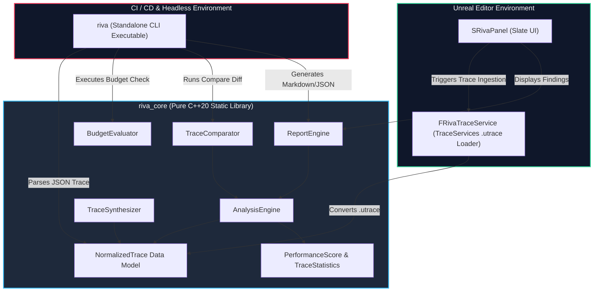
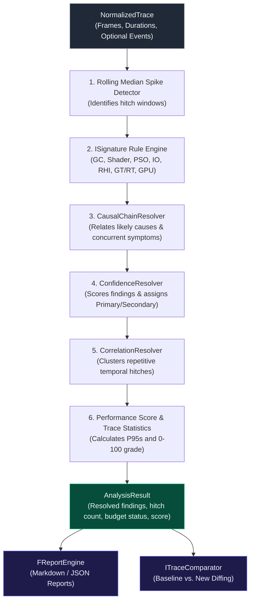

# System Overview & Pipeline Architecture

Riva is structured into two main decoupled layers:
1. **`riva_core`**: A pure C++20 static library containing trace models, signature algorithms, resolvers, comparator, budget parser, and reporting engine.
2. **`RivaEditor`**: An Unreal Engine Editor plugin exposing a native Slate UI panel (`SRivaPanel`) and TraceServices loader (`FRivaTraceService`).

## Subsystem Architecture Diagram

### Strict Decoupling Rules

- **Zero Unreal Headers in Diagnostic Core**: Code under `RivaCore/Public/riva` and the algorithm sources under `RivaCore/Private` rely on standard C++20. Only `RivaCoreModule.cpp` includes the Unreal module bootstrap header.
- **Normalized Data Model**: Native Unreal Insights recordings (`.utrace`) and JSON trace exports are translated into `riva::NormalizedTrace` before diagnostic processing.

## Core Diagnostics Pipeline

When `AnalysisEngine::Analyze(const NormalizedTrace& trace)` is executed, data flows sequentially through 6 pipeline stages:

### Pipeline Stages Explained

1. **SpikeDetector**: Evaluates frame duration metrics using a rolling median window to pinpoint hitch frames and calculate timing windows.
2. **Signature Rules**: Evaluates registered `ISignature` implementations (`STUT_GC`, `STUT_SHADER_COMPILE`, `STUT_PSO_MISS`, etc.) against spike windows and frame event markers.
3. **Causal Graph**: Applies explicit timing and evidence rules to relate possible causes and concurrent symptoms (for example, streaming IO near a Game Thread stall) and adjusts confidence. These are ranked diagnostic hypotheses, not proof of causation.
4. **Confidence Scoring**: Assigns calibrated confidence scores based on evidence weight and selects the `Primary` finding per hitch frame.
5. **Correlation Clustering**: Coalesces repetitive spikes across temporal windows into composite cluster findings.
6. **Performance Scoring**: Evaluates available trace metrics to compute `FTraceStatistics` (P50/P90/P95/P99) and assigns an `FPerformanceScore` (0-100 and A-F grades) from score targets and hitch density. Missing subsystem telemetry is reported as `N/A`; project budget evaluation is a separate gate.

## Evidence Classification Taxonomy

To uphold the "Claim Discipline" of the engine, every piece of evidence attached to a finding is tagged with an `EEvidenceClassification`:

- `OBSERVED`: Direct factual data (e.g., "GPU took 45ms").
- `DERIVED`: Computed metrics (e.g., "P95 exceeded by 10ms").
- `CORRELATED`: Temporally linked events across threads.
- `INFERRED`: Highly likely deductions based on causal chains.
- `SUSPECTED`: Low-confidence hypotheses requiring manual confirmation.
- `RECOMMENDED`: Actionable next steps provided by the rule engine.

## Synthetic Telemetry Generation

The `TraceSynthesizer` creates deterministic controlled fixtures with injected pathologies (for example, a PSO-miss event at frame 60). These fixtures support repeatable rule and UI regression tests. They do not establish real-world diagnostic accuracy; that requires representative captured traces and independently reviewed labels.
